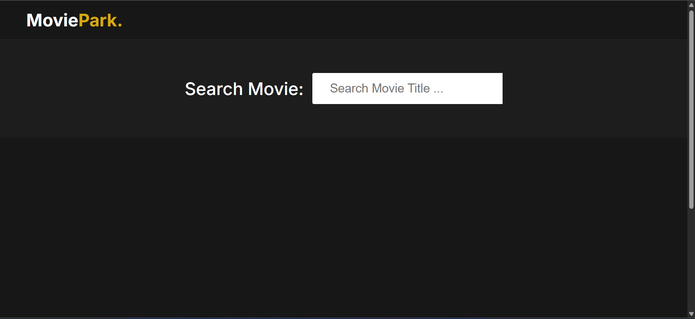

# 🎬 Movie Search Website  

A responsive and modern **Movie Search Web App** that allows users to search movies by title and view detailed information using the [OMDb API](https://www.omdbapi.com/).  

---

## 📖 Description  
Movie Search Website is a clean, fast, and user-friendly web app where users can explore movies in real-time. It fetches data from the OMDb API and shows:  
🎥 Posters, 📅 Release year, ⭐ Ratings, 🎭 Genre, 📝 Writers, 👥 Actors, 📖 Plot, and more.  

Built entirely with **HTML, CSS, and JavaScript (Vanilla JS)** — making it beginner-friendly and easy to understand.  

---

## 🚀 Features  
✅ Real-time movie search with auto-suggestions  
✅ Movie thumbnails with release year  
✅ Detailed information (title, rating, genre, actors, plot, awards, etc.)  
✅ Responsive design for desktop and mobile  
✅ Fallback image if poster is not available  

---

## 🛠️ Tech Stack  
- 🏗️ **HTML5** – Structure of the website  
- 🎨 **CSS3** – Styling & responsiveness  
- ⚡ **JavaScript (Vanilla JS)** – Logic and API handling  
- 🎬 **OMDb API** – Movie database  

---

## 📂 Project Structure  
```
├── index.html              # Main HTML file
├── index.css               # Stylesheet
├── index.js                # JavaScript logic
├── image-not-found.png     # Placeholder for missing posters (optional)
```

---

## ⚙️ Setup Instructions  

1. **Clone this repository** or download the files:  
   ```bash
   git clone https://github.com/VishnuKumarLH/movie-park.git
   cd movie-park
   ```

2. **Open `index.html`** in your browser.  
   *(No server required since it’s fully client-side.)*  

3. **Get your OMDb API key**:  
   - Sign up at [OMDb API](https://www.omdbapi.com/apikey.aspx).  
   - Replace the demo API key in `index.js`:  
     ```js
     const URL = `https://www.omdbapi.com/?s=${searchTerm}&page=1&apikey=YOUR_API_KEY`;
     ```

4. Save changes ✅ and refresh the browser 🚀  

---

## 📸 Screenshots  

🔍 **Search Results Example**  
 


---

## 🌟 Future Enhancements  
- ⏭️ Pagination for more search results  
- 🎞️ Movie trailers (YouTube integration)  
- ❤️ Favorite movies with local storage  
- 🌗 Dark/Light theme toggle  

---

## 🙌 Credits  
- 🎬 [OMDb API](https://www.omdbapi.com/) for providing movie data  
- 🎨 [Font Awesome](https://fontawesome.com/) for icons  

---

## 📢 Deployment (Optional)  
You can host this project for **free** using **GitHub Pages**:  
1. Push your project to a GitHub repository.  
2. Go to **Settings → Pages → Deploy from branch**.  
3. Select `main` branch and `/root`.  
4. Your app will be live at:  
   ```
   https://your-username.github.io/movie-search-app/
   ```

